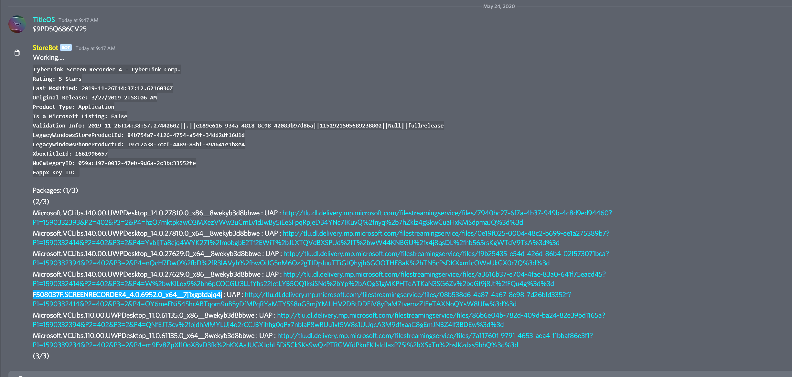
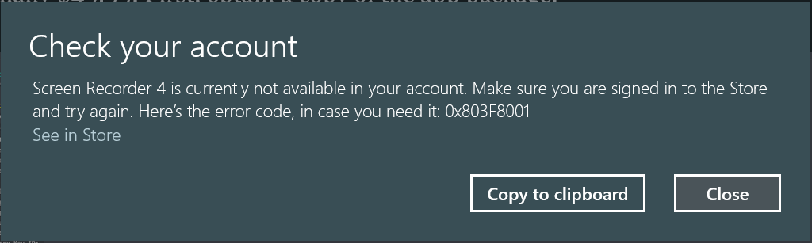
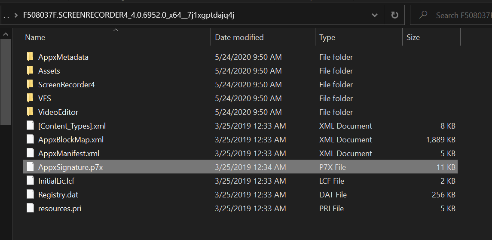
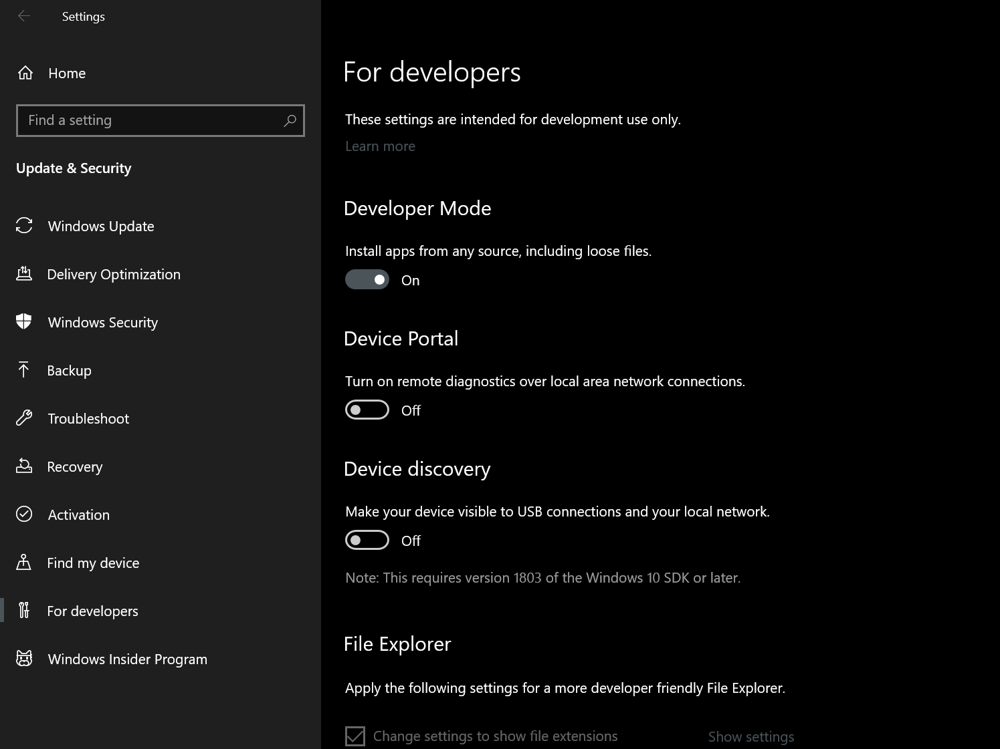
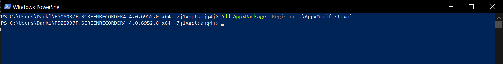
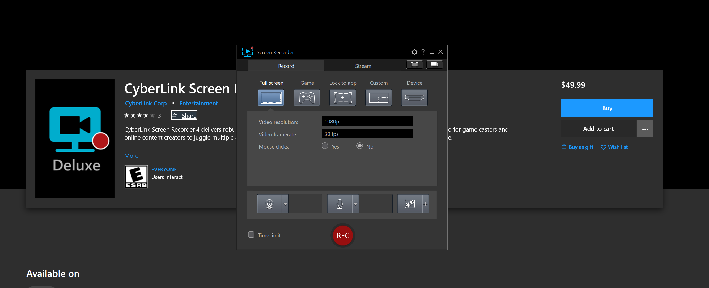

> Note: I do not condone or encourage piracy, this post is for informational purposes only. Microsoft has stated however that this is an intended feature and likely won't be patched in the future.

When downloading an app package from the MS Store using third party means such as [StoreLib](https://github.com/TitleOS/StoreLib) or [StoreBot](https://github.com/TitleOS/StoreBot), one will notice that Windows will reject launching the package on grounds of lack of licensing. (If the app/game was paid to begin with, or doesn't have the appLicensing capability).

For this example, I'll be installing " [CyberLink Screen Recorder 4](https://www.microsoft.com/store/productId/9PD5Q686CV25)" which is normally $49.99. First, obtain a copy of the app package.

If you attempt to install the app package in its current state, the app will successfully install, but upon attempting to launch, you will receive this error:

Let's fix this. First, extract the appx/appxbundle to a working directory, then delete "AppxSignature.p7x".

Afterwards, open Settings, navigate to Updates & Security, For Developers, and toggle on "Developer Mode".

Without this, the Add-AppxPackage command will fail.

Now, open a new Powershell window to the working directory, then run the following command:

-Register must point to the path of the AppxManifest.xml

The app will now successfully launch. It should be noted the above method only works on non-eappx/eappxbundle packages as there is no way to access the manifest in an encrypted app due to the decryption key being stored in the corresponding license.