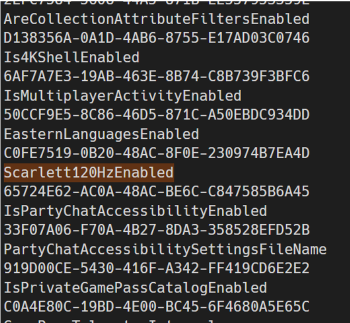
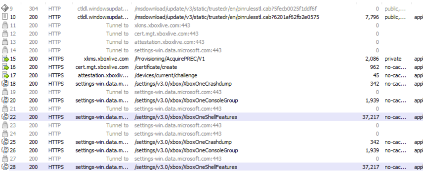
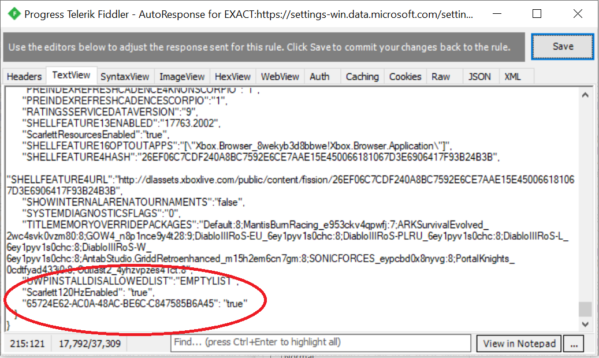
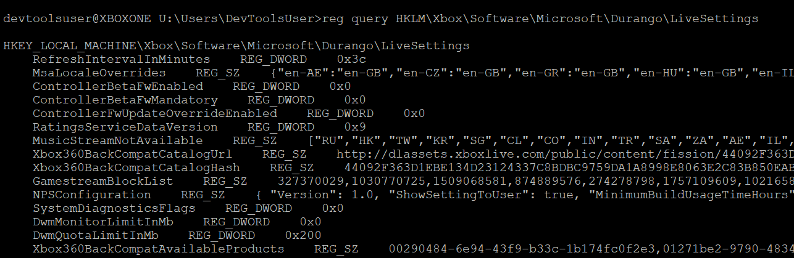
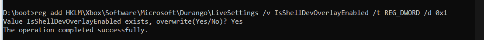

### Cloud Settings

The Xbox One's primary flighting system relies on the settings-win endpoint: "https://settings-win.data.microsoft.com". Xbox One flighting is divided up into 5 groups, accessible at the following paths:

`https://settings-win.data.microsoft.com/settings/v3.0/xbox/XboxOneNetworking https://settings-win.data.microsoft.com/settings/v3.0/xbox/XboxOneCrashdump https://settings-win.data.microsoft.com/settings/v3.0/xbox/XboxOneConsoleGroup https://settings-win.data.microsoft.com/settings/v3.0/xbox/XboxOneShellFeatures https://settings-win.data.microsoft.com/settings/v3.0/xbox/XboxOneTelemetry`

The SystemOS service Cloud Settings is responsible for maintaining the local flighting cache (LiveSettings), which is initialized on boot (and refreshed every 25 minutes) with the current flighting values from the above endpoints. Flighting can vary based on the optionally supplied user and/or device token. For example, "CONTROLLERBETAFWENABLED" from [XboxOneShellFeatures](https://settings-win.data.microsoft.com/settings/v3.0/xbox/XboxOneShellFeatures) is set to false when queried without an insider token, but returns true when queried with an insider token from the beta ring or above. The Cloud Settings service also provides APIs for other applications and services to query if a certain feature is enabled.

### Finding Flighting Details - Analysing CloudSettings.dll

The previously mentioned Cloud Settings service can be found at C:\Windows\System32\cloudsettings.dll on SystemOS. (For gaining access to the console's file system and transferring files, see [https://xosft.dev/wiki/setup-dev-mode/#using-ssh](https://xboxoneresearch.github.io/wiki/setup-dev-mode/)).

Cloud Settings contains the name and corresponding GUID for each implemented feature in plain text strings. Using a string dumper such as [strings2](http://split-code.com/strings2.html), it is possible to easily dump out a list of all flighting implemented in the current build, including features yet to be enabled.

_Example being a feature to toggle 120hz support on Scarlett devkits_

### Enable features via Fiddler/MITM

[Using Fiddler to inspect web service calls - Xbox Live\
\
Using Fiddler to log and troubleshoot Xbox Live service calls.\
\
Microsoft DocsXBL\
\
](https://docs.microsoft.com/en-us/gaming/xbox-live/test-release/tools/live-fiddler-inspect-web-calls#for-xbox-one-or-later-xdk-projects)

After configuring your Xbox devkit to use Fiddler (See [https://docs.microsoft.com/en-us/gaming/xbox-live/test-release/tools/live-fiddler-inspect-web-calls#for-xbox-one-or-later-xdk-projects](https://docs.microsoft.com/en-us/gaming/xbox-live/test-release/tools/live-fiddler-inspect-web-calls#for-xbox-one-or-later-xdk-projects)), simply reboot the console while Fiddler is capturing to see the flighting traffic next boot.

Along with settings-win.data.microsoft.com, a number of endpoints are low hanging fruit.

Using Fiddler's auto responder to manipulate the settings-win.data.microsoft.com traffic, simply edit the JSON body to either add new features (both the GUID and feature name must be added).

After rebooting or waiting for the flighting service to refresh the cache, the applicable features will be enabled.

### Enable features via SystemOS's registry

_The following method requires an admin or above shell on SystemOS. See Team XOSFT's Wiki entry for exploits that allowed for such in the past._ [https://xboxoneresearch.github.io/wiki/exploits/](https://xboxoneresearch.github.io/wiki/exploits/)

In addition to editing the flighting as the console retrieves it, it is also possible to add, toggle and remove flighted features from the local store. LiveSettings are stored in the SystemOS registry at the Xbox\Software\Microsoft\Durango\LiveSettings.

_The current settings can be queried using reg._

Once you have found a feature name and GUID from CloudSettings using the instructions above, it is very simple to add and enable the feature in the local store. I am using IsShellDevOverlayEnabled as an example. From the previously mentioned admin shell, simply use reg add to create a new dword with the feature's name as the key name.

Note: Live may revert your flighting

After rebooting your console to refresh any applications that check the flighting data, said features will be enabled accordingly.

* * *

From Microsoft's OSGWiki:

> "The recent leak of the voice assistant settings page was done by a hacker in the public insider ring, using reverse compilation to find the new live setting guid and then using fiddler with a man in the middle attack on a 3PP developer mode console to flip the live setting on, see the settings page, take a screenshot and then share it with a tech news site."