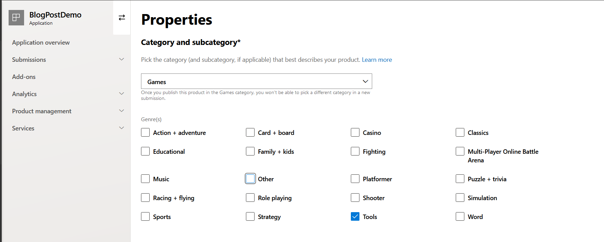
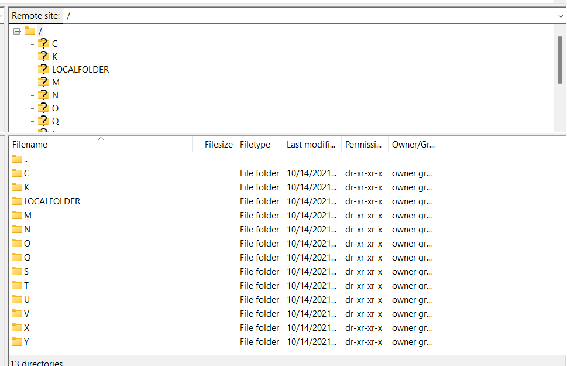
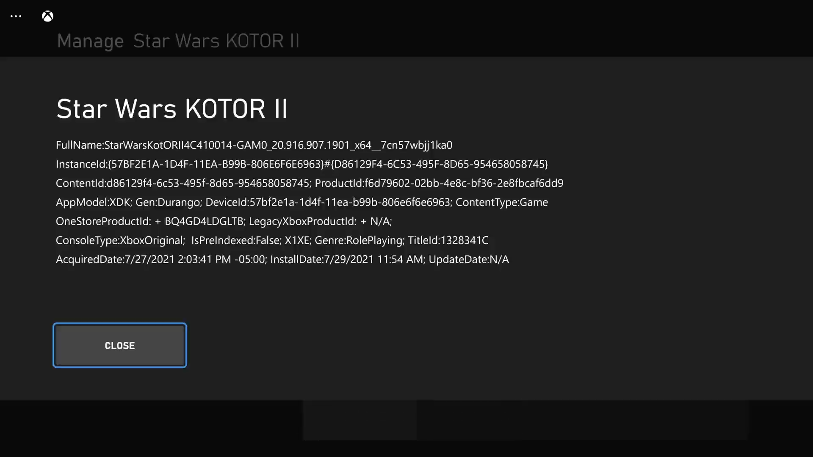
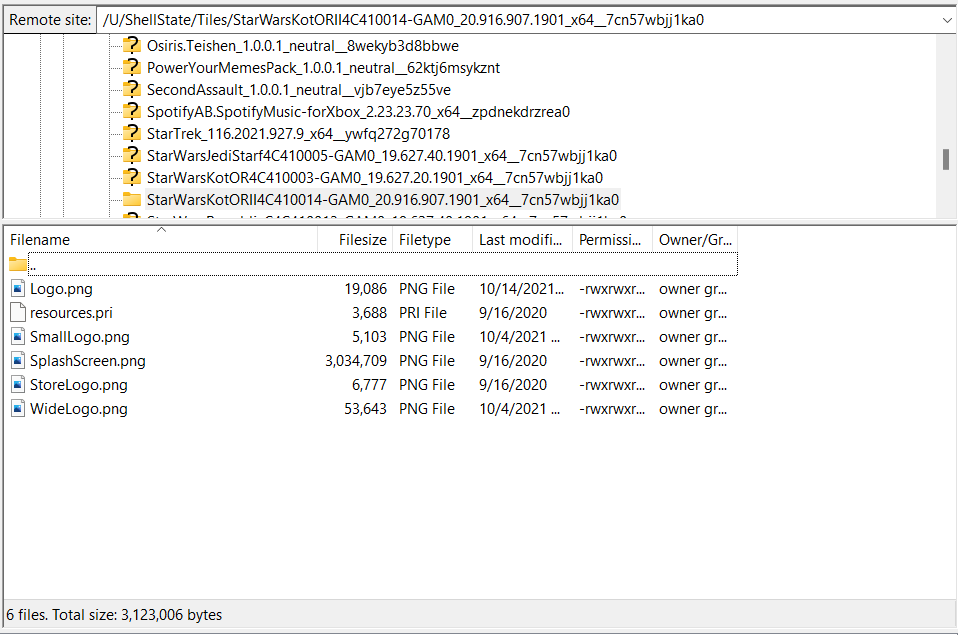
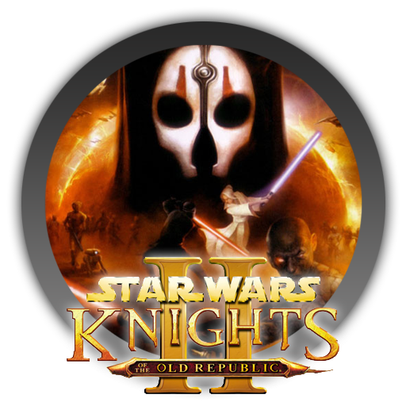
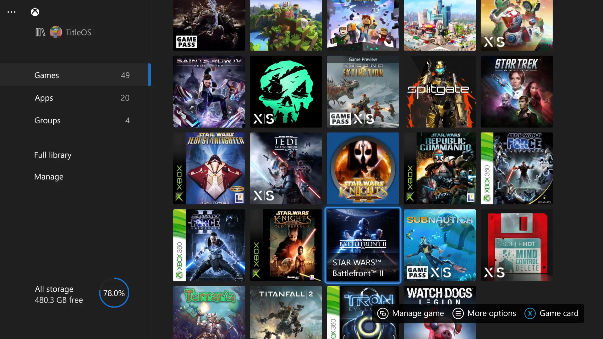

> Before we begin, it is necessary to have some way to browse and edit files in your _**Retail**_ mode. This can be achieved through a few different such as a UWP file browser running with the extendedResources cap or a UWP FTP Server with the same. For the purposes of this guide, I will explain how to build and deploy your own private UWP FTP Server app to the Windows Store, allowing you to download it in your Xbox's Retail mode.

Start by cloning the following open source repo: [https://github.com/Dantes-Dungeon/DURANGO-FTP](https://github.com/Dantes-Dungeon/DURANGO-FTP). Open the project in Visual Studio 2019, expand the "UniversalFtpServer" project, then right click and edit "Package.appxmanifest". Scroll down to line 28 and remove the following line:

<rescap:Capability Name="runFullTrust"/>

The next step will require a Microsoft UWP developer license, if you have a console converted to developer mode, then you already have one, if not, follow [this guide](https://docs.microsoft.com/en-us/windows/uwp/publish/opening-a-developer-account) and select the $20 Individual option.

Once you have created an account, navigate to [Partner Center](https://partner.microsoft.com/dashboard) and navigate to the "Windows & Xbox" Overview, then select create a new app. Name it anything you want, but try to avoid plainly calling it a FTP server or file browser, etc incase the app is manually reviewed (Very rare). Once you have created your app, select start your submission. This next step is very important and required for the FTP Server to have full file system access on the console. Select Properties, Category, then select **Games** from the dropdown.

Select any genre, just make sure you pick one.

Fill out the rest of the infomation on this page, then select save. Once you are returned to the submission screen, select Pricing and availability, then adjust your Visibility options to private audience and " _Make this product available but not discoverable in the Microsoft Store, and: Direct link only: Any customer with a direct link to the product’s listing can download it, except on Windows 8.x._". This step is also critical as private apps are not subjected to the same app certification/review process as public apps and will keep your app from showing up in the store's search, preventing it from getting reported and removed. After filling out the rest of the required infomation on this page, press save and return to the submission page.

Now for the moment, return to Visual Studio and the opened UniversalFtpServer project. After making the manifest edit described above, delete the "UniversalFtpServer\_StoreKey.pfx" and "UniversalFtpServer\_TemporaryKey.pfx" files, and then in Visual Studio's toolbar select Project, Publish, Create App Packages. Select distribution via the Microsoft Store, select the app you created earlier in Partner Center from the list, then follow through the rest of the steps including the automated certification test, ignore the results. If all goes well, you will be left with a .msixupload or .appxupload file (along with a few other application packages).

Now return to the submission page of your app in Partner Center, select Packages, and upload your compiled and packaged FTP server (the .msixupload or .appxupload file). After that, scroll down to Device Family Availability and untick "Let Microsoft decide whether to make this app available to any future device families". Tick the Windows 10/11 Xbox box and save the page. Return to the submission page and select the Xbox Creators Program section. Press enable, name it whatever you would like, make sure Xbox One is ticked, then confirm. Complete the rest of the submission process using [this guide](https://docs.microsoft.com/en-us/windows/uwp/publish/app-submissions) for reference, then submit your app to the store and wait for it to be pass through certification and be published on the store. Once that is complete, return to your app in Partner Center, select Product management, then Product Identity. Scroll down until you find your app's URL, then navigate to it. Select Install On My Devices, then select your Xbox and Push To Install the application.

Now that the app has been installed on your Xbox, open it, leave the settings all default unless you so wish to change them, then press Start. On your PC, using a FTP client such as FileZilla, open a new connection to the IP displayed on your Xbox, with the default port of 21 (unless you changed it). If all was done correctly with the app's flighting, you will see all the Xbox's partitions represented as folders like below:

If not, double check that you flighted your FTP Server app as a **game**. This is crucial as it provides your app the extendedResources capability at runtime, which is responsible for granting a UWP app full file system access.

Next, you are going to need the package family name for the game's assets you want to mod. This can be found easiest by opening Games and Apps on your console, highlighting the game of your choice, press start, Manage game and add-ons, then file info. Pay attention to the first line, FullName and take a picture or screencap through the Xbox Console Companion app.

For this example, I'll be modding KOTOR 2's tile

Now that you have that infomation, restart your FTP app if necessary and navigate to the following path: /U/ShellState/Tiles. You should see a number of folders, each named after an installed app or game, titled using the full package family name. Using the name you recorded earlier, scroll through the list until you find the game/app of your choice and open it. Inside, you should find several png files.

Ignoring the resources.pri, all these files can be replaced. While matching the original sizes is not required, as the console will stretch the image to fit, it is recommended. For my purposes, I will be replacing KOTOR II's tiles with the following image:

For reference, the original image sizes are:

> Logo.png -   208x208

> WideLogo.png - 480x480

> StoreLogo.png - 56x56

> SmallLogo.png - 100x100

Replace these images with the image of your choice, then highlight My games & apps in the guide, press start and refresh.

You should now see your modified logo in everywhere from the guides to My Games and Apps.

Note: Game Updates can and probably will wipe out your custom images, a minor inconvenience. A friend has reported .gifs are also accepted will be fully animated when displayed.