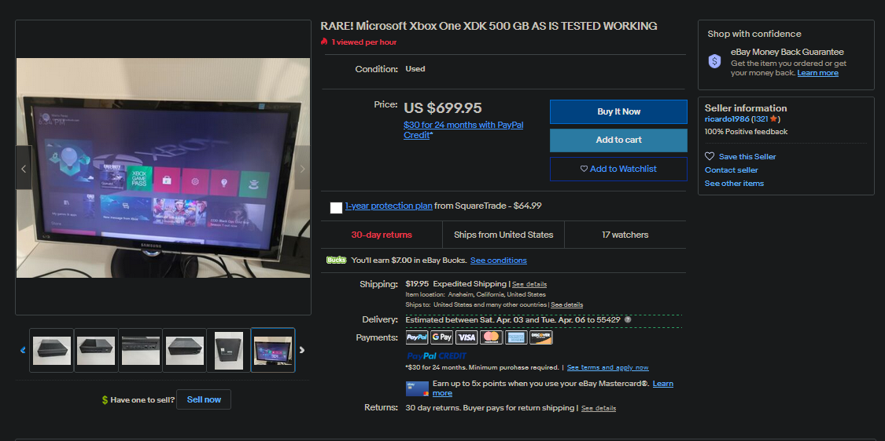
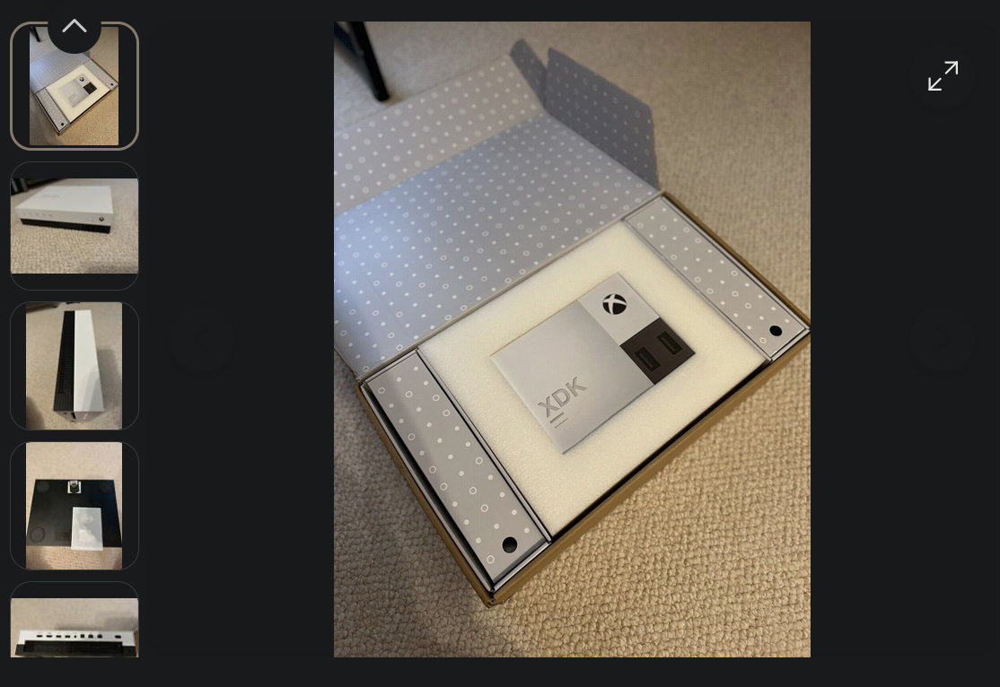
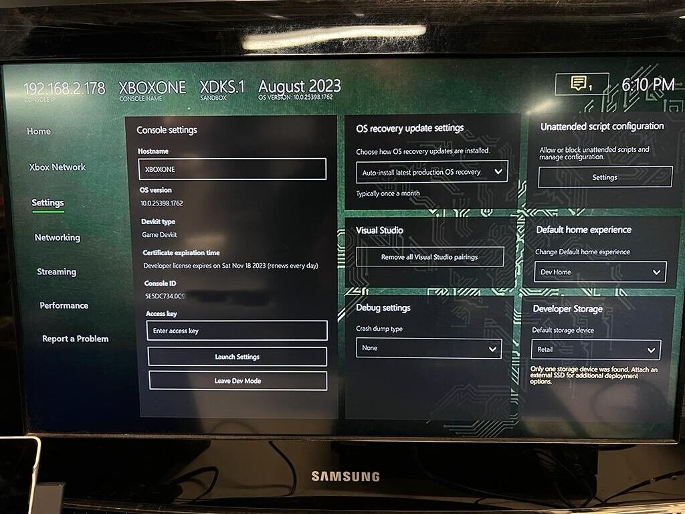
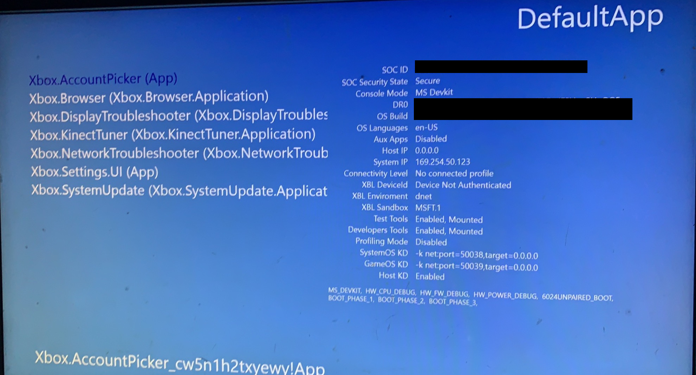
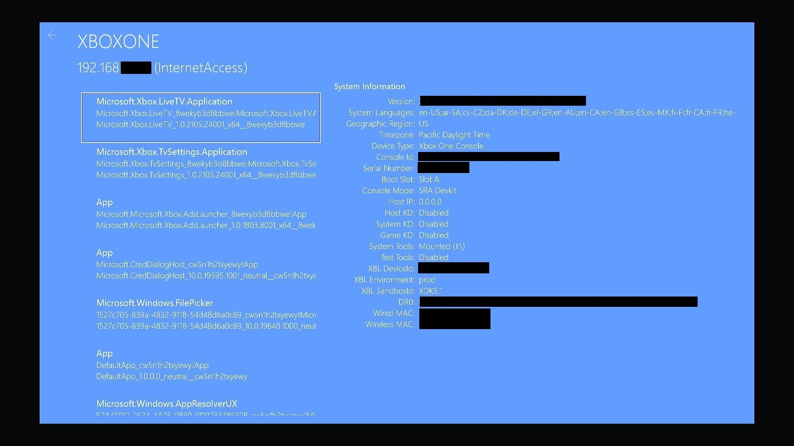

Over the past few years, a number of Xbox One (and now more recently Series X/Dante) devkits have surfaced on EBay and other auction sites, ranging from unactivated ID@Xbox kits to full on godboxes. Most, if not all of these listings give very little information about the console’s state, often only including pictures of the exterior, including activation QR codes (Which you should never expose, more info on that below.). As a result, I am creating this guide with the purpose to help a prospective Xbox XDK buyer identify a kit and it’s features before making an informed purchase.

## **What To Avoid:**

### Stickers included in case photos

As the first part of this guide, I will be covering what you should avoid when shopping for a Xbox XDK, the first of which is a listing that exposes the console’s stickers, including barcodes and QR codes.

Visible on this console’s bottom is what’s known as an Activation QR Code, often used on ID@Xbox and other ERA kits. This QR code, when decoded, contains the console’s serial, SOCID and other identifiable information that would allow Microsoft to ban the kit from the image alone. If you ever see a console for sale, openly advertising the stickers, assume it is at best a deactivated Retail and at worst a banned console.

### Consoles booted to the retail dashboard/not Devhome or DefaultApp

Any listing that shows a console booted to the retail dashboard, such as the one below, and not DevHome or DefaultApp (Also known as the "blue screen app"), should be assumed to be a now expired XDK, or a retail console.

Most, if not all devkits will refuse to leave Devmode while activated, simply switching back after a reboot if the button is pressed. There are rare cases where you may find an internal or era test kit that is able to switch to Retail, but these should be taken as the exception, not the rule. As a result, if you see a supposed XDK on the retail dashboard, it is no longer activated.

### **Consoles new in box**

If you are looking for an activated devkit (read usable), so basically any case where you are not a collector, you should avoid any still boxed XDK listings you come across. As Xbox devkits require activation upon reception by the game studio or internal employee, any console still in the box will not have gone through this process and will simply be a retail. Normally a game dev would scan the QR code present somewhere on the kit and be directed to the Microsoft Partners site where the console's information would be entered and a certificate generated and sent to the console over Xbox Live. Without performing this process (which you also can not do yourself without a game studio's account), the console will function exactly like a Retail because it is a Retail.

Such as this Chuckwalla devkit, given the XDK engraving and packaging, I assume it is an unactivated ID@Xbox kit.

### Which XDK is the XDK for you

Now that we've reviewed a few things you should avoid in a Xbox One/Series XDK, you should think about exactly what you are buying a developer kit for, what are your intended purposes? This will help narrow down what to look for in a good devkit. Do you want to do homebrew game or app development? Or are you interested in reversing the operating systems, fuzzing drivers and the like? Maybe you are looking to develop a new operating system all together on the XBox hardware and need access to the bootloaders? As I've covered in another [post](__GHOST_URL__/keys-to-the-kingdom/) Xbox One and Series devkits are bestowed with a capability certificate that defines their authorized developer features, so you should look for a console featuring a certificate with capabilities you require. While a homebrew developer would be just fine with an ERA/Game Devkit, a reverse engineer would likely require a internal or SP kit to get access to HostOS and the console's hardware. Someone looking to dump or modify retail games would need to be even more picky, finding a devkit that possesses the Green (Production) decryption keys. ( _**99% do not**_.) While you can get a general idea of the XDK's type via a screenshot of Devhome or the Developer settings page, the only sure-fire way to guarantee the capabilities you are looking for is to have the seller check DefaultApp (Depending on the build) or dump certkeys.bin from the flash.

A properly redacted DevHome showing the Devkit type under Console settings.

DefaultApp however is included on every console from early pre-launch builds to the latest Skip Ahead release, but it is often hidden if the console doesn't boot to it directly. While it no longer lists active capabilities in later OS builds, it is still an easier method on earlier builds than dumping and reading the certificate from the flash and can provide information if kernel debugging, test tools, etc are enabled.

Older Defaultapp listing active capabilities at the bottom.Newer Defaultapp without capabilities while still listing kernel debugger status and tools.

After you think you've decided on a console that is activated and has your desired capabilities, there is one more thing you should be aware of, certificate expiration. The certificates that give a Xbox it's developers capabilities, often contain an expiration date after which the certificate is no longer considered valid by the console's platform security processor. Once this certificate expires, a developer kit will attempt to renew the certificate from Xbox Live, which, if it is still activated on a developer's account, will simply require a reboot and the kit will be back to it's usual state. However, should the console no longer be activated (Such as if the serial was exposed during the selling listing and Microsoft deactivated the console themselves, they do this and often wait until the final day of the auction.), it's renewal will failure, and the console will factory reset it's hard drive, wiping any and all dev content before trashing it's keys and reverting to a retail state. (Note, some devkits, like prototype Chuckwallas, seem to be unable to revert to a retail life and will simply boot to a E200 System Error after this point).

There are basically two ways to check a certificate's expiration date, through Devhome and through dumping the certificate directly from the flash. If you have a dump of your flash, parts of your certificate can be read using the XBFSTool included in [xvdtool](https://github.com/emoose/xvdtool). If you do not have access to a flash dump, then you must refer to the Settings page of Devhome shown at the beginning of this post. Certificate expiration time is what you are looking for under console settings. Now, if this value reads "renews every day" such as in my provided screenshot, this means your devkit will require a check-in with Xbox Live every 24 hours to maintain a valid certificate. This doesn't mean your console is only activated for 24 hours however, but simply that the expiration time given on the local certificate file is short, if your console is properly activated and connected to the internet, it will receive a new certificate every 24 hours in the background, if not, the console will revert to retail and try again once there is an internet connection. The other value listed that you should be aware of, that says "Developer License expires on" is the actual expiration date of your certificate overall, meaning after this point, your console may lose activation and no longer renew. This is not a guarantee however either way, your console may renew after this point and list a new expiration date another two months away, or it may not and revert to a retail, it all depends on the account the console is activated on. Luckily, most Internal kits and above are issued an infinite certificate without an expiration date, allowing you to avoid the hassle of finding an activated console and maintaining a risky connection to Xbox Live. (Note: The console may still list a negative or past expiration date, such as June 1969, in this case, this can be safely ignored as a UI bug.)

### Additional Tips:

- Look for consoles featuring gray cases instead of their normal white or black. (Slims, One Xs and Chuckwallas all follow this) Gray is used to signify a next generation hardware prototype. So a gray cased slim is actually a One X, and a gray cased Chuckwalla is a Series X.
- If possible, avoid connecting your devkit to Xbox Live. If Microsoft identified the console during the sale somehow, this will prevent the console from receiving the ban state message. In addition, connecting the console will change it's last used IP and geo-region, something Microsoft may be monitoring and note, causing a ban or deactivation.
- Motherboards featuring a blue, orange, red or other color besides green PCB. These consoles are often devkits with prototype or earlier revisions of motherboards, as non-green dye is cheaper to use during development, which could be useful for a hardware developer or reverse engineer.