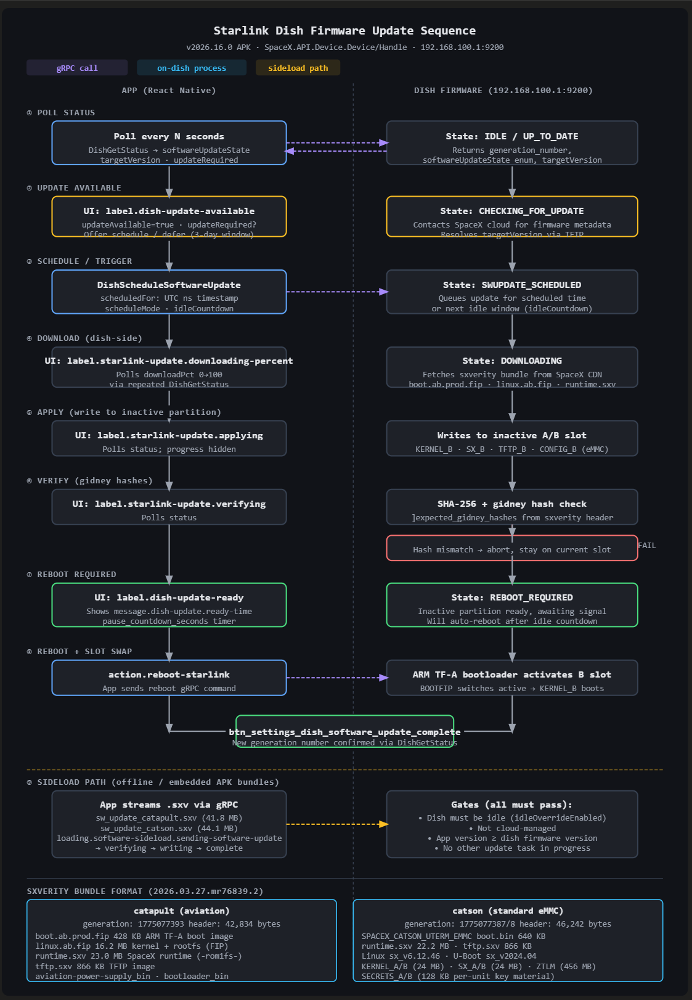
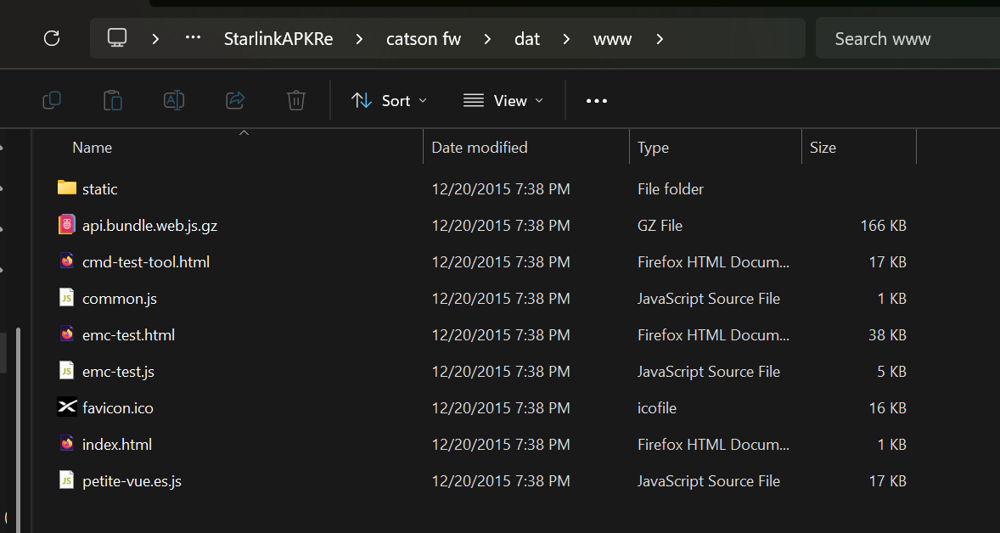
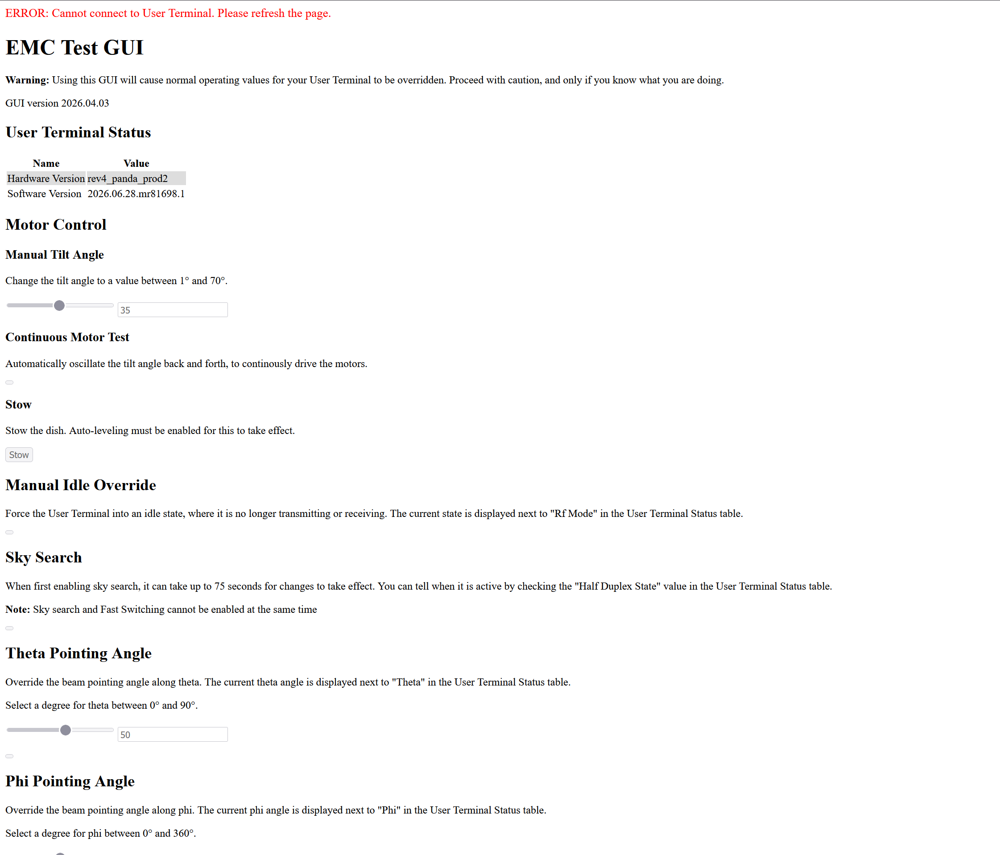
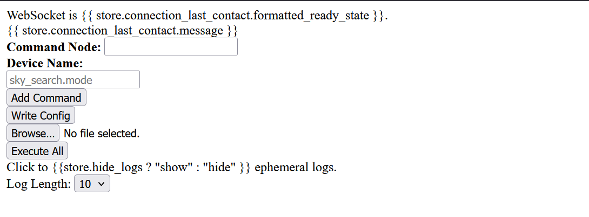

# Exploring the Star(link)s
This is a blog post about basic reverse engineering of the Starlink APK v2000015367, including the discovery of two internal test pages accessible in the newer Dish/User Terminal diagnosis page.

The day started out as most normally do, deciding on something to try to break today. Despite living in an apartment, I have Starlink's Residentual 100mbps plan, with the dish totally securely zipped tied to my balcony. Despite not living on the top floor, I only have about a 13% obstruction, and suffer zero drop outs, so as a result, in addition to buying it for security research, I have a legitimate backup ISP for when Quantum Fiber goes down, and they do. Infact, I have my Opnsense VM configured with WAN fallover from QF to Starlink should such a thing happen, but that's a story for another time. Despite having sadly given Elon my money for the past several months, I hadn't really made good on the "buying it for security research" staple I told myself, until today that is. 

### Disclaimer and Notes
This post is not endorsed or sponsored by Starlink, neither is my work. I worked indepentently and legally in my reverse engineering of the Starlink product(s). Claude, specifcally Sonnet 4.6 High Effort was used to aid in via the use of the ApkTool MCP Server, but was not used in the writing of this blog post at all, 100% human mistakes here. 

## Decoding the Starlink APK
This adventure starts out with my dumping the as of this post, current version of the Starlink APK from my Pixel 9a. This produced `com.starlink.mobile_v2000015367.apk`, SHA256: `03a295c4681eca133cfec9b1cf58ceddd83dcd8ef1f6e0a5d303dd9f34f1c808`. Using the APKTool [MCP Server]("https://github.com/SecFathy/APktool-MCP/tree/main"), I instructed Sonnet 4.6 on the High Effort under Claude Code to decode the APK, and dispatch my string hunter subagent after any interesting strings, like secrets or endpoints. This netted the usual Sentry, Firebase, MapBox API keys, nothing much of interest, though it's worth noting the public CA cert `SpaceX Router Root CA Certificate`, is accessible at assets/router_root_ca.pem. This is used for app to router TLS. 

## Reversing the update flow, and discovering sideloading
With the strings not revealing any low hanging fruit, I decided to dispatch Claude to find and describe the firmware update flow for the Dish(y) hardware. This revealed how the OTA flow is 9 stages, starting with the app polling the dish's software version and OTA state. If the dish reports an update is available, the app becomes aware, and the user pause the update for up to 3 days throguh the UI. After the user's decision, the update is scheduled. Once the UTC timestamp is hit, the dish beginnings downloading the sxverity bundle from the SpaceX CDN. Like modern smartphones, the Xbox console, and other devices, the Starlink dish employs an A/B bootslot system, and the dish writes the images it has downloaded to the inactive slot. So if Slot A is currently booted, Slot B is written to. Oddly enough, only after the writing is the hash then verified in the sxverity's header. If the hash doesn't match, the update is aborted, and the dish remains on the current slot. Assumign the hash passes, the dish begins to count down for an auotmatically update, waiting until it recieves the reboot command from the app. While rebooting, the dish's ARM TF-A bootlaoder activates the inactive bootslot, and the new FW boots. Should something fail, the bootloader rolls back. The app finally confirms the new version and the update is confirmed as complete. If anyone is interested in a visual aid, Claude generated the SVG flow below:



## Extracting the firmware file: sw_update_catson.sxv
Noting that in some states, the flow will proceed with an offline sideloading, I located two firmware files, sw_update_catson.sxv and sw_update_catapult.sxv in the assets folder, for non-aviation and aviation dishes respectively. Binwalking `sw_update_catson.sxv` revealed a RomFS filesystem, named `sxverity` with a total size of 45.8mb. Extracting the RomFS file system resulted in the a folder structure featuring `bin`, `dat`, and `revision_info` folders. `revision_info`'s sole contents is a text file named `version_info.txt` with the following contents (This research was conducted on 07/21/2026): 
```
Constellation Branch, ssh://git@stash:7999/sat/satcode.git
Constellation Version, d2db9be25af5f37f9b642e7ac7ad1b2833efac3a
Gauntlet Build ID, a2d5a7b6-04d8-4f3d-b80f-5f522cc6f725
Gauntlet Pipeline, satellite_starlink_point_release_user_2026_03_27_mr76839
Gauntlet Run Number, 3
Manifest, None
Rocket Platbundle, 48ae65b18e3e38c8211e01ecad5dbfa67ea76120
```

## Disassembling the firmware image & General Exploration
The `bin` folder and `dat` folders are much more interesting, with `bin` being a folder of batch scripts and other helper files, while `dat` features an apparmor.d listing, along with a folder for nearly every Starlink hardware revision, from `board_rev_hp1_aviation_proto0` and `board_rev_mmut` to `board_rev_rev5_pez_proto1` and even transceivers: `board_rev_transceiver_rev2p5`. Despite including mostly `.include` files, the purpose of the `dat` folder isn't exactly clear, with some files like `\firmware\v4_catson\boot_rom_ut_mcu_bin.bin.signed` clearly being firmware, others like `board_rev_rev5_pez_proto1\thermal_control_board_rev` indicating configuration files for unknown pieces of Starlink hardware. While I'm sure we will revisit these goodies in the future, it's another folder in `dat` that drew my eye, and spawned this blog post, `www`. 

## Discovery of www folder for dish diagnosis page
For those who are unaware, if you have a Starlink dish and router, you can access some diagnostic and other sorts of infomation from the user terminal by browsing to `http://192.168.100.1` in your browser.
This page was recently revamped and now includes a map of your obstructions for example. What I quickly realized, is that I had the www folder contents of this diagnostic page in the extracted firmware image: 



Instantly, I noticed the existance of `emc-test.html` & `cmd-test-tool.html`, tools not presented normally on the diagnostics page. Reviewing the Javascript for `cmd-test-tool.html` revealed that the page doesn't use gRPC like most Starlink tools, instead attempting to open a WebSocket connection to port 8065 on 192.168.100.1. This is the dish(y)'s Slate bus, SpaceX's internal real-time parameter telemetry framework. From what I can gather, the Slate protocol allows for the constant reception of events pushed as JSON objects, such as obstruction events. In addition however, commands can also be sent along the connection, using the following formats, with user1 being the default root node:
```
ro user1.<device_name>           # read-only subscription
si user1.<device_name> <int>     # set integer value
sf user1.<device_name> <float>   # set float value
```
I'm currently unclear if the Slate WS is exposed on consumer hardware however, or if direct LAN access, bypassing the router, would be required.

`emc-test.html` on the other hand creates a `DeviceClient` using a gRPC-Web connection to port 9021, seperate from the TLS gRPC on port 9200, with no TLS, no auth header. This exposes a huge amount of control, including theoretically `idle override, motor tilt, sky search, fast switching (CW/BPSK/QPSK/8QAM/16QAM/32QAM/64QAM), theta/phi beam pointing, RX/TX channel override, duty cycle, snow-melt, EIRP adjustment, PLL unlock, and reboot` functionality. Every 50ms, the call `DishGetEmcRequest` is made, which returns the Dish's state. In addition, `GetDeviceInfoRequest` is called once, to poll the hardware & software versions, and related infomation. Changes made are submitted via a call with `DishSetEmcRequest`.

## EMC-Test and CMD-Test-Tool on Consumer Hardware
Despite what static analysis reveals, the pages aren't as simple as indicated. My setup features a Starlink 4 Standard Dish & normal Starlink router. When on my Starlink connection, I am able to access both pages using the direct url paths, as seen below:





However, most options are grayed out. This indicates the Slate WS connection is likely not accessible, but I'm not certain as to why the emc-test page doesn't function properly. As I continue to explore this
and future Starlink firmware extractions, I'm sure additional blog posts will follow, until then, I hope you found this read interesting, and I appreciate any additional insight any other reverse engineers may have. 