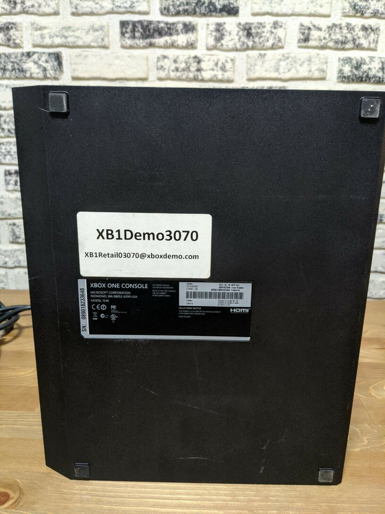

**Kiosk Xbox One consoles make use of a @xboxdemo.com Microsoft account to play demos, this account has a gamertag following the "XB1Demo0000" format. While these accounts are only intended for in-store demo use, many are now being used as personal profiles by people who have purchased second-hand kiosk consoles, with their personal info attached, game purchases made, etc.**

When browsing EBay for Xbox One consoles, I came across a former kiosk unit that featured an interesting sticker on the bottom, similar to the one below:

 xb1retail03070@xboxdemo.com

I had not seen the @xboxdemo.com domain before and tested if the email was a valid MSA, which it was. After another quick test, I discovered the numbers in the email were sequential, with xb1retail03069@xboxdemo.com and xb1retail03071@xboxdemo.com both being valid accounts as well. I then checked to see the number of xboxdemo accounts that existed by adjusting the number sequence. Just over 15 thousand accounts appear to exist, ranging from 00000 to 15000:

Continuing to investigate the domain, I discovered the ownership history to be very murky, but via WHOIS history, I found out the last owner of the domain let it expire in 2012.

After investigating the xboxdemo accounts further, I discovered that every account listed itself as the "forgot password?" recovery option:

Having purchased the xboxdemo.com domain, I was able to setup a catch-all email box for any email heading to \*@xboxdemo.com. In addition to receiving emails from the active accounts like purchase receipts and parential reports:

Microsoft Family child purchase notice

I could also receive the verification codes required to reset the passwords for any of the xboxdemo accounts. To do this, I simply attempt to log into the xboxdemo account of my choicing, for this example I'll use xb1retail15000@xboxdemo.com, select the forgot password flow, choose to have the verification code sent to xb1retail15000@xboxdemo.com, then recieve the code in my catch all inbox, and continue the forgot password flow, allowing me to enter the new password and take over the account:

After making this discovery, I attempted twice to inform Microsoft of the account takeover issue and offered to return the domain to them. The first time, through the MSRC Portal, the report was simply closed without comment. The second time, after following up via email, I was told by MSRC:

> This report looks to be a type of vulnerability we call “Sub-domain takeover”, which is unfortunately not a type of vulnerability we service.

It has now been several months since the MSRC report and Microsoft still has not taken me up on my offer to return the domain, or done anything to secure the xboxdemo accounts, despite numerous accounts actively being used by paying customers as a result of used console purchases. Besides the couple accounts I reset for the proof of concept and this post, I have left the vast majority untouched. I am continuing to hold the domain to prevent a more nefarious party from purchasing it and abusing the accounts as Microsoft is unwilling to secure them.